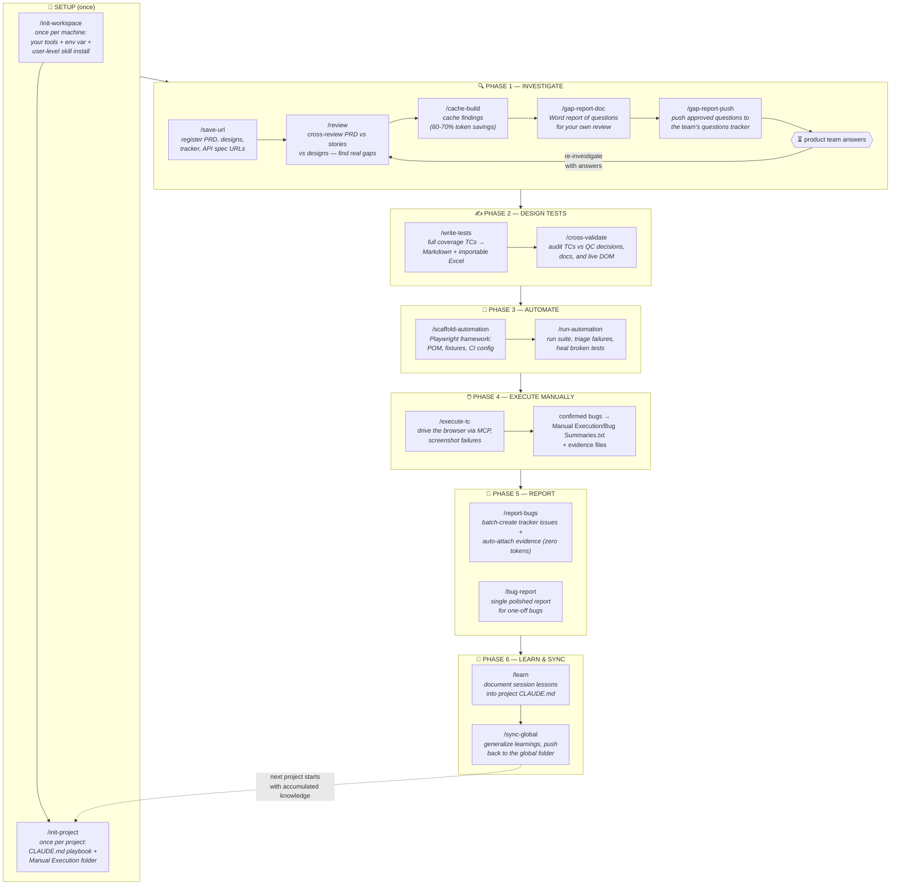
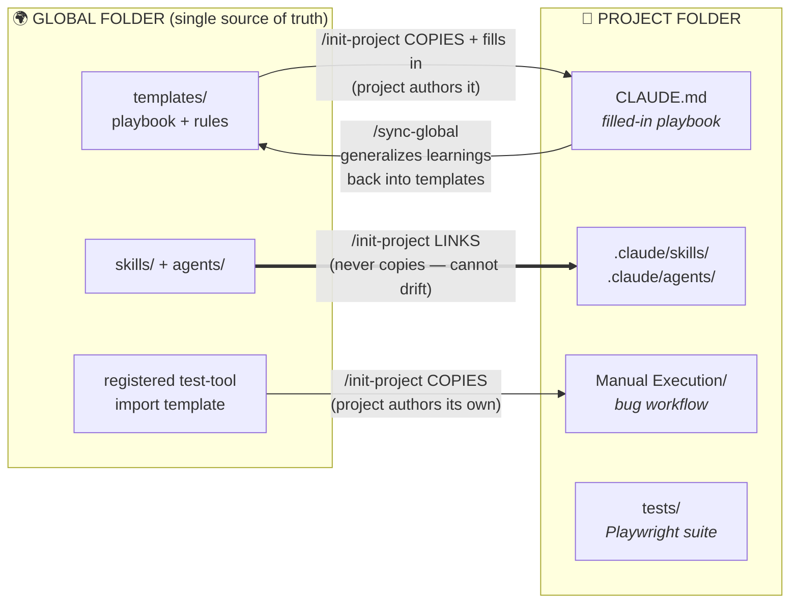
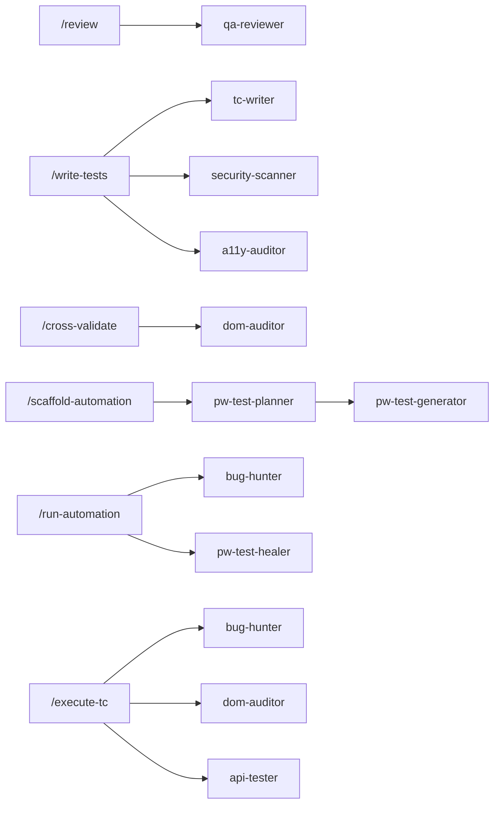
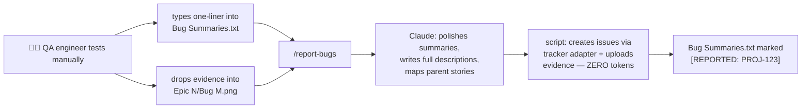

# QA-Orchestrator — Portable QA Infrastructure for Claude Code

A tool-agnostic, shareable "global QA folder": **37 skills**, **10 agents**, templates, and scripts that give [Claude Code](https://claude.com/claude-code) a complete, opinionated QA methodology — investigation, gap analysis, test case design, automation, execution, and bug reporting.

**Nothing here is tied to a specific company or vendor.** Your issue tracker (Jira, Azure DevOps, Linear, GitHub Issues, …), test management tool (Qmetry, TestRail, Zephyr, Xray, …), docs platform (Notion, Confluence, SharePoint, …), and design tool are all configured **once per user** via `/init-workspace`.

---

## Table of Contents

- [Quick Start](#quick-start)
- [The Journey — Start to End](#the-journey--start-to-end)
- [Folder Structure](#folder-structure)
- [Skills Catalog](#skills-catalog)
- [Agents Catalog](#agents-catalog)
- [The Manual Execution Bug Workflow](#the-manual-execution-bug-workflow)
- [Connecting Your Issue Tracker](#connecting-your-issue-tracker)
- [Sharing & Security](#sharing--security)
- [Design Principles](#design-principles)

---

## Quick Start

1. **Clone or copy this folder** anywhere on your machine (e.g., `C:\Users\you\QA-Global` or `~/qa-global`).
2. **Open Claude Code in this folder** and tell Claude:
   > Read `skills/init-workspace/SKILL.md` and follow it.

   (On a fresh copy the `/init-workspace` slash command isn't registered yet — skills only auto-load from `.claude/skills/` or `~/.claude/skills/`, so you bootstrap by pointing Claude at the file once.) The wizard will:
   - **LINK all skills and agents user-level** (`~/.claude/skills/`, `~/.claude/agents/` → this folder, via junction/symlink) — after this, every `/command` works in any folder on your machine, and editing this folder updates them everywhere with nothing to re-run. See **[LINK-VS-COPY.md](LINK-VS-COPY.md)** for why links (not copies) are used for shared files.
   - Set the `QA_GLOBAL_HOME` environment variable to this folder's path
   - Ask which tools your team uses and write `workspace.config.json`
   - Optionally set up a bug-reporter tracker adapter + credentials (`scripts/.env`)
3. **Per project:** open Claude Code in your project folder and run **`/init-project <name>`** (available everywhere after step 2).
4. Work the journey below.

---

## The Journey — Start to End

The full lifecycle, from a blank machine to a tested feature with learnings fed back for the next project:



> **Anytime:** `/checkpoint` saves your session context to a file before you step away; `/session-resume` restores it. `/learn` also fires automatically when Claude detects corrections, QC decisions, or new patterns mid-session.

### Phase-by-phase, with the agents

**🏁 Setup.** `/init-workspace` runs once per user: **links** skills/agents user-level so every command works in any folder, sets `QA_GLOBAL_HOME`, and records your company's tools in `workspace.config.json`. `/init-project` runs once per project: it **links** skills + agents to this folder (never copies — see [LINK-VS-COPY.md](LINK-VS-COPY.md)), then **copies** the files the project authors — `CLAUDE.md` from the playbook template (13 setup questions fill the placeholders), `qa-rules-condensed.md`, the `Manual Execution/` folder, and your test tool's import template.

**🔍 Phase 1 — Investigate.** `/save-url` registers every reference URL so no session ever re-asks for them. `/review` cross-references PRD ↔ user stories ↔ design files with two-pass self-verification (so it raises only *real* gaps, not questions the docs already answer) — for large scopes it spawns **qa-reviewer** agents to deep-read each document in parallel, and consults the security/accessibility/validation technique skills to catch missing requirements. `/cache-build` freezes the findings into cache files that later commands read instead of re-analyzing everything. `/gap-report-doc` turns findings into a Word report you review; `/gap-report-push` pushes the approved questions to your team's questions tracker. When product answers arrive, the skill mandates a **re-investigation pass** — an answer to question A often invalidates assumption B.

**✍️ Phase 2 — Design tests.** `/write-tests` applies the SFDP decomposition framework (States, Fields, Data, Permissions) and the coverage matrix (happy/negative/boundary/edge/security/accessibility/localization, negatives ≥ 30%). Before any case is written it builds a **requirement clause inventory** (traceability matrix: clause → behaviour → case) and a **behaviour inventory** (one behaviour = one case, variants as steps), so nothing is missed and nothing is duplicated. For 5+ stories it then spawns **tc-writer** agents in parallel with disjoint behaviour lists, each returning a "not covered" list, plus **security-scanner** and **a11y-auditor** for specialized cases. Spec-silent behaviours get a case on a stated assumption, and a **coverage gate** and a **duplicate gate** must pass before output. Output: readable Markdown + an Excel file matching *your* test tool's import template exactly. `/cross-validate` then audits every expected result against QC decisions and the live DOM — spawning **dom-auditor** to catch "ghost elements" (UI that exists in specs but not in the app).

**🤖 Phase 3 — Automate.** `/scaffold-automation` builds a production-grade Playwright framework (Page Object Model, auth-state reuse, multi-environment config, CI pipeline) — **playwright-test-planner** explores the live app to design scenarios and **playwright-test-generator** writes specs while verifying every selector against the real DOM. `/run-automation` executes the suite, then spawns **bug-hunter** to classify failures (real bug vs. locator drift vs. timing vs. environment) and **playwright-test-healer** to fix broken tests — never the app.

**🖱️ Phase 4 — Execute manually.** `/execute-tc` drives the browser through your test cases via Chrome MCP, with a 5-step popup recovery protocol before any test is marked blocked. **api-tester** verifies API-level cases. After execution, **bug-hunter** triages the failures and **dom-auditor** confirms the UI facts. Every confirmed bug is appended as a one-liner to `Manual Execution/Bug Summaries.txt` and its screenshot/recording saved under the evidence naming convention.

**🐞 Phase 5 — Report.** `/report-bugs` is the batch reporter: Claude polishes each one-liner into a professional bug report (summary, steps, expected/actual, environment) and auto-maps it to the right parent story; then a plain Node.js script creates the issues through your tracker's adapter and **uploads each bug's evidence files automatically** — zero LLM tokens spent on API calls. `/bug-report` writes a single polished report when you need one immediately.

**🧠 Phase 6 — Learn & sync.** `/learn` documents session discoveries (QC decisions, defect patterns, tool quirks, corrections) into the project's CLAUDE.md. `/sync-global` generalizes them — strips project names, story keys, entity names — and pushes them into the global templates. **Your next project starts with everything every previous project learned.**

---

## Folder Structure

```
QA-Global/
│
├── 📄 README.md                    ← you are here
├── ⚙️ workspace.config.json        ← YOUR tools (created by /init-workspace — not shipped)
│
├── 📁 skills/                      ← 37 skills (each = <name>/SKILL.md)
│   │
│   │   WORKFLOW COMMANDS (18) — the /commands of the journey:
│   ├── init-workspace/  init-project/  save-url/
│   ├── review/  gap-report-doc/  gap-report-push/  cache-build/
│   ├── write-tests/  cross-validate/
│   ├── scaffold-automation/  run-automation/
│   ├── execute-tc/  bug-report/  report-bugs/
│   ├── learn/  sync-global/  checkpoint/  session-resume/
│   │
│   │   TECHNIQUE REFERENCES (19) — methodology & framework knowledge:
│   ├── unified-qa/  test-plan-generation/
│   ├── playwright-e2e-testing/  playwright-enhanced/  playwright-api-testing/
│   ├── form-validation-breaker/  auth-bypass-tester/  owasp-security-testing/
│   ├── axe-core-accessibility/  bug-report-writing/
│   ├── api-testing-rest/  postman-api-testing/
│   ├── appium-mobile-testing/  maestro-mobile-testing/
│   └── ci-cd-pipeline-config/  advanced-allure-reporting/
│
├── 📁 agents/                      ← 10 subagents (7 custom + 3 Playwright MCP)
│   ├── qa-reviewer.md      tc-writer.md        bug-hunter.md
│   ├── dom-auditor.md      security-scanner.md a11y-auditor.md
│   ├── api-tester.md
│   └── playwright-test-planner.md  playwright-test-generator.md
│       playwright-test-healer.md
│
├── 📁 templates/
│   ├── QA_Test_Design_Playbook_-_Template.md   ← master playbook ({PLACEHOLDER}-driven)
│   ├── qa-rules-condensed.md                   ← all skills condensed to rules
│   ├── CLAUDE-md-skills-section.md             ← appended to project CLAUDE.md
│   ├── CLAUDE-md-caching-section.md            ← token-optimization rules
│   └── qmetry-template.xlsx                    ← EXAMPLE test-tool import template
│
├── 📁 scripts/
│   ├── report-bugs.js              ← tracker-agnostic zero-token bug reporter
│   ├── report-bugs-README.txt      ← script command reference
│   ├── .env.example                ← credential template (copy to .env — NEVER commit .env)
│   └── adapters/
│       └── _template.js            ← adapter contract: copy → implement → done
│
└── 📁 reference/                   ← human-readable deep documentation
    ├── QA-Commands-Reference.txt   ← every command explained
    ├── QA-Agents-Reference.txt     ← every agent explained
    └── QA-Folder-Structure-Reference.txt ← global ↔ project file flow
```

And how files flow between the **global folder** (the single source of truth) and each **project folder**.

**The rule ([LINK-VS-COPY.md](LINK-VS-COPY.md)):** *link what the project only **consumes**, copy what the project **authors**.* Skills and agents are **linked** so they can never go stale; the playbook, rules file, and bug-workflow files are **copied** because each project writes to its own.



---

## Skills Catalog

### Workflow commands (18)

| Command | Phase | What it does |
|---|---|---|
| `/init-workspace` | Setup | One-time wizard: your tracker/test tool/docs platform, `QA_GLOBAL_HOME`, user-level skill install, optional tracker adapter |
| `/init-project` | Setup | Full project scaffold: CLAUDE.md playbook, skills/agents, `Manual Execution/`, test-tool template, 13 setup questions |
| `/save-url` | Investigate | Registers reference URLs (PRD, designs, tracker, API) in `project-references.md` — available to every later command |
| `/review` | Investigate | Cross-reviews PRD ↔ stories ↔ designs with two-pass self-verification; outputs real gaps, conflicts, and confirmed behaviors |
| `/cache-build` | Investigate | Caches investigation output so later commands skip re-analysis (60–70% token savings) |
| `/gap-report-doc` | Investigate | Turns review findings into a color-coded Word report for stakeholder review |
| `/gap-report-push` | Investigate | Pushes approved questions to your questions tracker (Notion / Confluence / ADO wiki / SharePoint / …) |
| `/write-tests` | Design | Generates full-coverage test cases (SFDP framework) → Markdown + Excel matching your test tool's template |
| `/cross-validate` | Design | Audits generated TCs against QC decisions, docs, and live DOM; catches contradictions and ghost elements |
| `/scaffold-automation` | Automate | Builds a Playwright framework: POM, fixtures, multi-env config, security/a11y/API specs, CI pipeline |
| `/run-automation` | Automate | Runs the suite, categorizes failures, spawns healer for broken tests |
| `/execute-tc` | Execute | Executes TCs via Chrome MCP with popup recovery; logs confirmed bugs + evidence into `Manual Execution/` |
| `/bug-report` | Report | Writes one polished, tracker-ready bug report; queues it in `Bug Summaries.txt` |
| `/report-bugs` | Report | Batch-reports `Bug Summaries.txt` via the zero-token script; auto-discovers and attaches evidence files |
| `/learn` | Learn | Auto-documents session lessons into project CLAUDE.md + condensed rules |
| `/sync-global` | Learn | Generalizes project learnings and pushes them back to the global templates |
| `/checkpoint` | Anytime | Saves full session context to a file before you step away |
| `/session-resume` | Anytime | Restores a checkpoint and continues where you left off |

### Technique references (19)

| Skill | Knowledge it carries |
|---|---|
| `unified-qa` | Master methodology: investigation process, SFDP, coverage matrix, quality gates, DOM auditing, RBAC test generation, hard-won lessons |
| `test-plan-generation` | Test plans, coverage matrices, risk-based prioritization, estimation |
| `playwright-e2e-testing` | Page Object Model, selector strategy, fixtures, assertions |
| `playwright-enhanced` | Multi-env config, trace debugging, visual testing, mobile emulation |
| `playwright-api-testing` | `APIRequestContext` for REST/GraphQL testing |
| `form-validation-breaker` | Boundary values, injection payloads, encoding edge cases, client-bypass |
| `auth-bypass-tester` | RBAC, IDOR, JWT manipulation, session management, privilege escalation |
| `owasp-security-testing` | OWASP Top 10 patterns, security headers, CORS |
| `axe-core-accessibility` | WCAG 2.1 AA, keyboard navigation, screen readers, focus management |
| `bug-report-writing` | Title formulas, severity matrix, evidence patterns, API/mobile bug formats |
| `api-testing-rest` | REST patterns, status codes, schema validation, contract testing |
| `postman-api-testing` | Collections, environments, Newman CI, data-driven testing |
| `appium-mobile-testing` | iOS/Android automation patterns |
| `maestro-mobile-testing` | YAML-flow mobile UI testing |
| `ci-cd-pipeline-config` | GitHub Actions, Jenkins, GitLab CI test integration |
| `advanced-allure-reporting` | Allure reports, trends, flaky-test detection, CI dashboards |
| `qa-dom-audit` | Live DOM verification of buttons/menus/actions against a spec — catches ghost UI elements |
| `enforcement-tc-gen` | Role x module x action micro TCs for RBAC/permission enforcement (.docx + .md) |
| `module-areas-manager` | Maintains the module-areas config mapping modules to UI areas, actions, and selectors |

---

## Agents Catalog

Agents run in **isolated context** — they do focused heavy work in parallel and return only results, keeping your main conversation clean.

| Agent | Spawned by | What it does |
|---|---|---|
| `qa-reviewer` | `/review` | Deep-reads PRD/stories/design notes/API specs in parallel; extracts testable facts, gaps, conflicts (read-only) |
| `tc-writer` | `/write-tests` | Generates test cases per epic in parallel, following SFDP + your import format |
| `security-scanner` | `/write-tests`, `/review` | OWASP Top 10 + auth-bypass review of specs and configs |
| `a11y-auditor` | `/write-tests`, `/execute-tc` | axe-core / WCAG 2.1 AA accessibility audits |
| `dom-auditor` | `/cross-validate`, `/execute-tc` | Inspects the live app via Chrome MCP; catches ghost elements before they become always-failing tests |
| `api-tester` | `/execute-tc` | Executes API requests; verifies contracts, status codes, schemas |
| `bug-hunter` | `/execute-tc`, `/run-automation` | Classifies failures (real bug / locator / timing / environment / flaky), groups duplicates, prepares `Bug Summaries.txt` lines |
| `playwright-test-planner` | `/scaffold-automation` | Explores the live app and designs the test plan |
| `playwright-test-generator` | `/scaffold-automation` | Writes Playwright specs, verifying each selector against the live DOM |
| `playwright-test-healer` | `/run-automation` | Debugs and fixes failing specs — patches test code, never the app |



---

## The Manual Execution Bug Workflow

The human-friendly loop at the heart of manual testing — you type one-liners, drop screenshots, and everything else is automated:

```
{project}/Manual Execution/
├── Bug Summaries.txt        ← type each bug as a one-liner under "Epic N:" sections
│                               "Bug 5: Totals recompute wrong after edit (back end)"
├── Epic 1/                  ← evidence per epic, named by bug number:
│   ├── Bug 5.png                screenshots, recordings
│   ├── Bug 11.mp4               "Bug 13 (2).png" = extra file for the same bug
│   └── Bug 13 (2).png
└── bug-*.json               ← reporter artifacts (config / overrides / descriptions / tracking)
```



Claude does the **intelligence** (polished summaries, full reproduction steps, parent-story mapping, priority signals); a plain Node.js script does the **execution** (tracker API calls, attachment uploads) — so a 20-bug batch costs ~3–5K tokens instead of ~35–55K *per bug*.

---

## Connecting Your Issue Tracker

`/report-bugs` never calls a tracker API directly — it loads an adapter from `scripts/adapters/<tracker>.js`. To connect yours (Jira, Azure DevOps, Linear, GitHub Issues, …):

1. Copy `scripts/adapters/_template.js` → `scripts/adapters/<your-tracker>.js`
2. Implement `createIssue()` per the contract documented in the template (Claude can write it with you — provide your tracker's API docs and auth method). Optionally implement `addAttachments()` for automatic evidence upload — without it, the script lists files per issue for manual drag-and-drop.
3. Set `"tracker": "<your-tracker>"` in the project's `bug-reporter.config.json`
4. Copy `scripts/.env.example` → `scripts/.env` and fill in the credentials your adapter requires

---

## Sharing & Security

- **NEVER commit `scripts/.env`** (credentials). Only `.env.example` ships — and the included `.gitignore` enforces this.
- `workspace.config.json` is per-user (also git-ignored) — each engineer runs `/init-workspace` to create their own.
- The shipped `templates/qmetry-template.xlsx` contains only sanitized sample data.
- Project folders created by `/init-project` are your own working copies — they live outside this repo.

---

## Design Principles

- **Config over hardcoding** — tool names, URLs, IDs, and people live in `workspace.config.json` (per user) and per-project configs, never inside skills.
- **Intelligence vs execution split** — Claude does the thinking (parsing, mapping, writing); plain scripts do the API calls (zero tokens).
- **Learn and sync back** — `/learn` captures lessons per project; `/sync-global` generalizes them into the shared templates so every future project starts smarter.
- **Tool-specific knowledge is labeled** — lessons that only apply to one tool are tagged (e.g., "Tool-specific example: Notion") with the transferable rule stated alongside.
- **Confirm, don't assume** — skills mandate DOM audits before UI test cases, premise validation before questions, and re-investigation after product answers.
